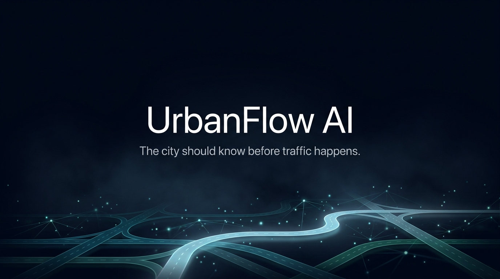
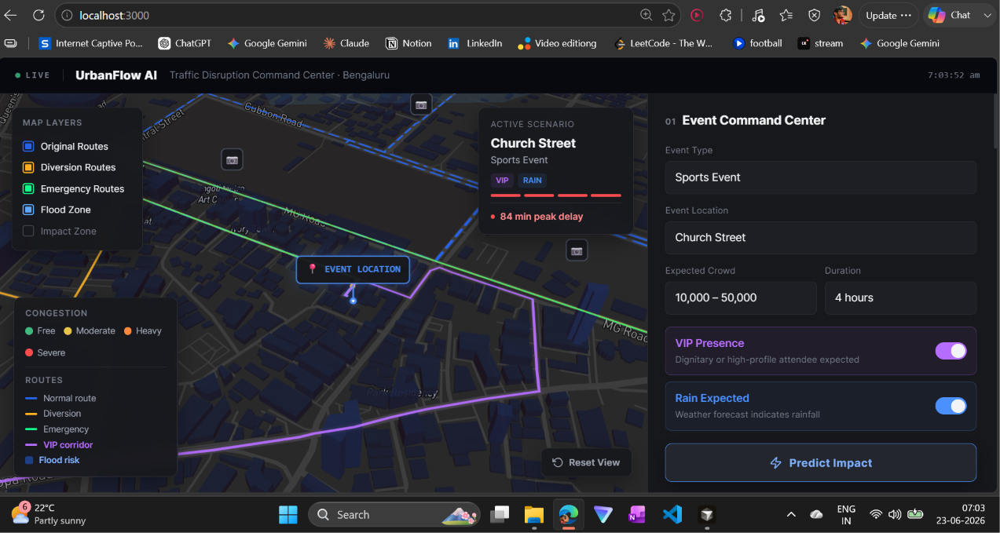
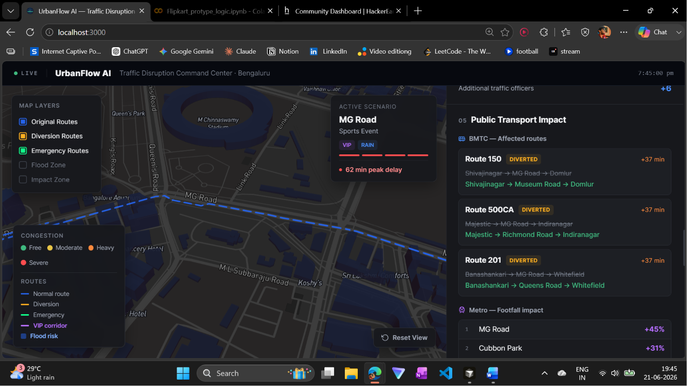
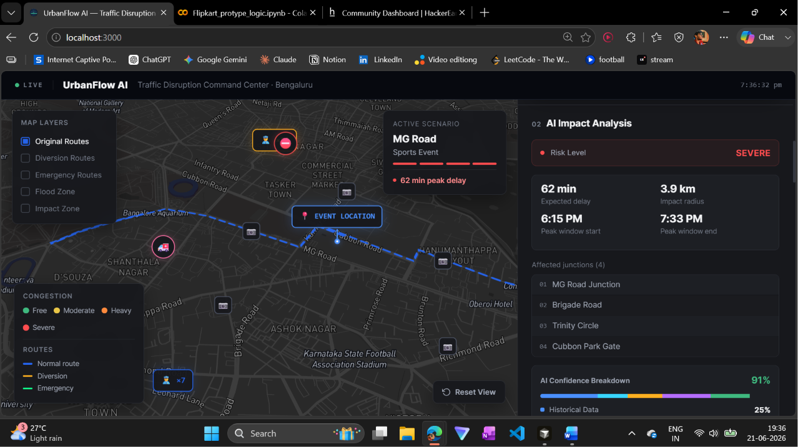
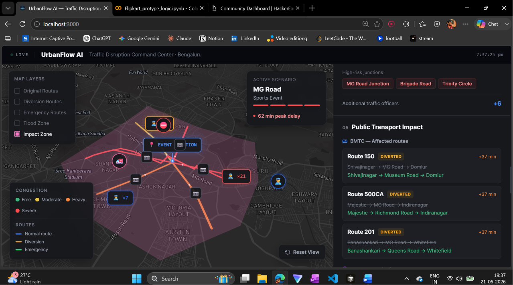
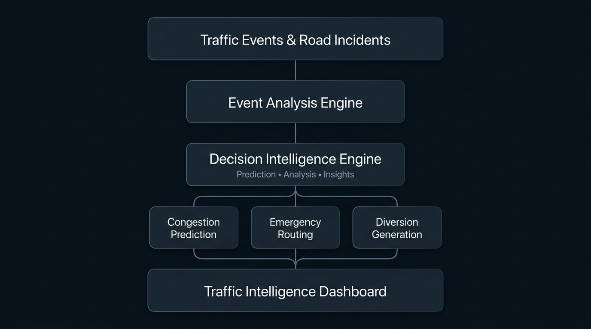

<p align="center">
  
</p>

<br>

<h1 align="center">UrbanFlow AI</h1>

<p align="center">
The city should know before traffic happens.
</p>

<p align="center">
AI-powered predictive traffic intelligence for modern cities.
</p>

<br>

<p align="center">
  
</p>

<br>

<p align="center">
  <b>Complete Prototype Demonstration</b>
</p>

<p align="center">
  🎥 https://www.youtube.com/watch?v=9CBeCARttgE
</p>


<p align="center">
Predict • Prevent • Prioritize
</p>

---

# UrbanFlow AI

UrbanFlow AI is an intelligent traffic intelligence platform that predicts congestion, prioritizes emergency movement, and recommends proactive traffic actions before congestion spreads.

Traditional systems answer:

> Where is traffic right now?

UrbanFlow AI answers:

> Where will traffic happen next?

The platform combines predictive analytics, route intelligence, and traffic reasoning to help cities become proactive instead of reactive.

---

# Vision

Modern cities react to traffic after congestion has already occurred.

* Emergency vehicles lose valuable response time.
* Traffic jams spread rapidly.
* Road incidents create cascading congestion.
* Operators receive delayed information.
* Existing systems lack predictive intelligence.

UrbanFlow AI aims to become an intelligent traffic layer capable of anticipating congestion, optimizing emergency movement, and assisting traffic operators with actionable insights.

---

# Product Preview

<p align="center">
  
  
</p>

<br>

<p align="center">
  
  
</p>

---

# Capabilities

### Traffic Prediction

Analyze traffic conditions and estimate future congestion zones.

### Emergency Intelligence

Generate optimized routes for emergency vehicles.

### Smart Diversion

Recommend alternate paths to reduce congestion spread.

### Traffic Insights

Provide intelligent traffic recommendations.

### Interactive Mapping

Visualize incidents, congestion, routes, and traffic behavior.

### Analytics

Monitor traffic patterns and hotspot regions.

---

# Why UrbanFlow AI

| Conventional Systems | UrbanFlow AI                |
| -------------------- | --------------------------- |
| Reactive             | Predictive                  |
| Static navigation    | Intelligent routing         |
| Manual analysis      | Intelligent recommendations |
| Present conditions   | Future forecasting          |
| Delayed decisions    | Proactive intelligence      |

---

# Architecture

<p align="center">
  
</p>

---

# Technology

### Frontend

* Next.js
* React
* Tailwind CSS
* Mapbox GL JS
* Recharts

### Backend

* FastAPI
* Python
* Pandas
* NumPy
* Scikit-learn

### Intelligence Layer

* Predictive Analytics
* Traffic Analysis
* Route Optimization
* Event Analysis

---

# Project Structure

```text
UrbanFlow-AI
│
├── assets/
│   ├── banner.png
│   ├── demo.gif
│   ├── dashboard.png
│   ├── map.png
│   ├── analytics.png
│   ├── insights.png
│   └── architecture.png
│
├── backend/
├── frontend/
└── README.md
```

---

# Quick Start

Clone the repository.

```bash
git clone https://github.com/Abhishekanand19/UrbanFlow-AI.git

cd UrbanFlow-AI
```

---

# Prerequisites

* Python 3.10+
* Node.js 18+
* npm
* Internet connection for map services

---

# Backend Setup

Navigate to the backend directory.

```bash
cd backend

python -m venv venv
```

Activate the virtual environment.

### Windows

```bash
venv\Scripts\activate
```

### Linux / macOS

```bash
source venv/bin/activate
```

Install dependencies.

```bash
pip install -r requirements.txt
```

Start the FastAPI server.

```bash
uvicorn main:app --reload --port 8000
```

Backend:

```text
http://localhost:8000
```

---

# Frontend Setup

Open another terminal.

```bash
cd frontend
```

Install dependencies.

```bash
npm install
```

If dependency conflicts occur.

```bash
npm install --legacy-peer-deps
```

Install the required package.

```bash
npm install canvg
```

Start the development server.

```bash
npx next dev
```

Frontend:

```text
http://localhost:3000
```

---

# Running UrbanFlow AI

### Terminal 1

```bash
cd backend

venv\Scripts\activate

uvicorn main:app --reload --port 8000
```

### Terminal 2

```bash
cd frontend

npx next dev
```

Open:

```text
http://localhost:3000
```

---

# Future Directions

* Live traffic API integration
* IoT sensor integration
* CCTV-based incident analysis
* Smart traffic signal optimization
* Reinforcement learning traffic control
* Government traffic data integration
* Mobile applications

---

# Team

### Abhishek Anand


### Aashlesh P


---

# License

This project is intended for educational, research, and demonstration purposes.

---

<p align="center">
Built for intelligent and proactive urban mobility.
</p>
